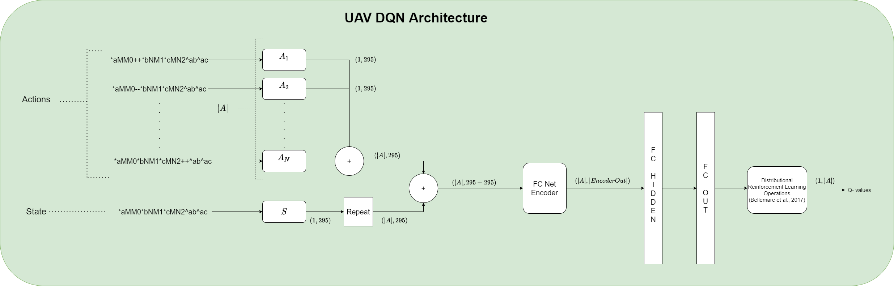
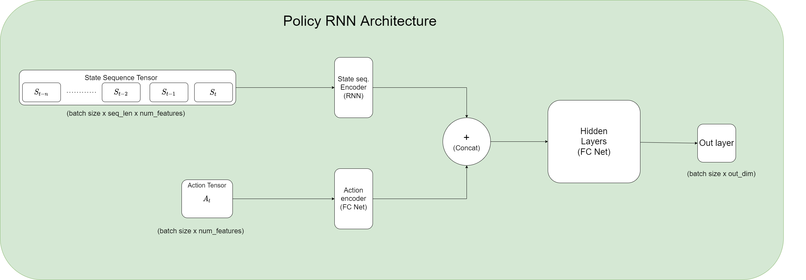

# UAV-Design Repository

## General information
Repository for the Aalto University Probabilistic Machine Learning Group's Summer 2022 Cooperative AI and User 
Modeling project. Project focuses on AI assisted UAV (Unmanned Aerial Vehicle) a.k.a 'drone' design. The code in
this repository is primarily based on the research papers:

- [Zero-shot Assistance in Novel Decision Problems (2022)](https://arxiv.org/pdf/2202.07364.pdf) by Sebastiaan De Peuter and Samuel Kaski
- [When Faced with Increasing Complexity: The Effectiveness of Artificial Intelligence Assistance for Drone Design (2022)](https://asmedigitalcollection.asme.org/mechanicaldesign/article/144/2/021701/1114945/When-Faced-With-Increasing-Complexity-The) by 
Binyang Song et al.

- [Rainbow: Combining Improvements in Deep Reinforcement Learning (2017)](https://arxiv.org/pdf/1710.02298.pdf) by Matteo Hessel et al.

### Project members
- Supervisor: Professor Samuel Kaski
- Co-advisor: Sebastiaan De Peuter
- Research assistant: Yujia Guo
- Research assistant: Aleksanteri Sladek (aleksanteri.sladek.aalto.fi)

---

## Project structure
Brief descriptions of root folder contents
- data - stores raw and preprocessed data, and code for interacting with this data
- experiments - stores results for experiments and notebooks
- tools - external code, f.e the HyForm testbed and interface for it
- inference - code for interfacing with the models
- model - code for UAV design models
- scripts - assorted "one-off" code scribblings (i.e hacky garbage)
- utils - assorted helper scripts
- rl - reinforcement learning code
- docs - documentation, research papers, metadata
- hparams - stores experiment hyperparameter JSON files

TODO: Make directory level readme's for important folders (data, experiments, model)

## Running instructions
### Pre-requisites
Make sure to install Python version >= 3.8.X and the required modules. Python modules needed are easily installed via 
the Python package manager pip. For example:
- python3 -m pip install --user -r requirements.txt

Unix command for installing the python modules listed in the requirements.txt file in the user's home directory
(--user facilitates cases where sudo rights aren't available).


### Running experiments

**IMPORTANT**: 
- When running scripts from this repo, **ensure that your working directory is the root folder of the repo 
(UAV-Design)**. Using other working directories will cause imports, filepaths etc. to not work as they are using relative locations.

The primary entrypoint for NN experiments is 'main.py', with hyperparameters loaded from an 
*_hparams.json file (path to which is specified as the arg -p to the main.py script). Passing a hyperparameters
template file such as train/crnn_hparams.json will train a new model. Make sure to set the desired hyperparameters
in this file before running the script. For working with existing models, whether it be retraining or generation,
the 'main.py' script needs to be passed a hyperparameters file from an existing folder in the 'experiments' folder.
**Make sure to set the 'experiment_type' field in this file to specify the type of experiment to run.** 

Experiment types currently supported:
- 'train' - Train the model
- 'generate' - Generate samples from the model
- 'predict' - Get predictions from a model
- 'simulate' - Run the HyForm or NN surrogate simulator
- 'eval' - Get evaluation metrics for a model
- 'traineval' - Run both the train and eval modes back to back
- 'kfold' - Run a K-fold cross-validated experiment
- 'run_dqn' - Training a RainbowDQN network

Alternatively, the experiment type can also be passed through the command line as argument -t.

#### Examples (how I run the script):
Training a surrogate simulator network with a test/validation set 
```
python3 main.py -p hparams/nn_hparams.json -t traineval
```

Running a K-Fold cross-validated surrogate simulator training experiment:
```
python3 -u main.py -p hparams/nn_hparams.json -t kfold
```

Training a DQN network:
```
python3 -u main.py -p rl/dqn_hparams.json -t run_dqn
```

### *_hparams.json hyperparameter options, requirements and other instructions
TODO: Write up an explanation on using the hyperparameters file for controlling experiments.


---
## Using the simulator surrogate NN
There are two methods for using the simulator surrogate NN:
1) File IO method
2) Simulator interface method (e.g for use within your own code)

### 1) File IO method

Done via the running the main.py script:
```
python3 main.py -p trained_models/sim_rnn/full_simrnn_hparams.json -t simulate -i data/datafiles/preprocessed/test.csv -o results.csv
```

Where the -p argument specifies the hyperparameters file for the model, -t the experiment type, -i the input file (drones to simulate) and -o the file to write results to.
Note that input file must be a .csv file with column "config" containing the drone strings.

Models supported are the RNN-based simulator in trained_models/sim_rnn and FCNN-based simulator in trained_models/sim_nn.

Output file will contain columns with predicted values for all metrics. Note that the FCNN simulator currently will not return drone strings into the output file due to limitations of the codebase
and "reverse-encoding" from the matrix encoding not being implemented yet.


### 2) Interface method

This requires instantiating the NNSimulator class (inference/NNSimulator.py). This class takes as its init argument a
Hyperparams class object (train/Hyperparams.py), which is basically just a wrapper for the *_hparams.json file provided as
input to the main.py file. Once the simulator is instantiated, its 'simulate' and 'simulate_batch' methods can be called
to get simulations for a single drone string or a list of drone strings respectively. These methods will return
a pandas DataFrame with the results. 

Example:

````
from inference.NNSimulator import NNSimulator
from train.Hyperparams import Hyperparams

hparams_file = "trained_models/sim_rnn/full_simrnn_hparams.json"

# Instantiate hyperparams and simulator
hparams = Hyperparams(hparams_file)
simulator = NNSimulator(hparams)

# If GPU not setup for torch, uncomment this line
# hparams.device = torch.device('cpu')

# Run for a single design string
uav = "*aMM0++++*bNM2+++*cMN1+++*dLM2+++*eML1+++^ab^ac^ad^ae,5,3"

results = simulator.simulate(uav)

# Run for a batch
uav_list = [
    "*aMM0++++*bNM2+++*cMN1+++*dLM2+++*eML1+++^ab^ac^ad^ae,5,3",
    "*aMM0++++*bNM2+++*cMN1+++*dLM2+++^ab^ac^ad,5,3",
    "*aMM0++++*bNM2+++*cMN1+++^ab^ac,5,3"
]

results = simulator.simulate_batch(uav_list)
````

## Deep Q-Learning Network for the UAV Design problem

The main purpose of incorporating a Deep Q-Learning Network into this project is to have a method for solving the
designer's problem of finding the correct design actions to maximize their design reward function. This section 
will briefly outline the architecture of the DQN network and how it operates.

The DQN network is based on the RainbowDQN architecture outlined in "Rainbow: Combining improvements in Deep
Reinforcement Learning" (2017) by Hessel et al. and [its PyTorch implementation](https://github.com/Kaixhin/Rainbow) 
by Arulkumaran et al. This implementation was modified to account for the variable size action space and the 
different state representation present in the UAV Design problem. The final model can be found in model/DQN.py.

The architecture is shown below:


The basic idea is that in order to deal with a variable sized action space, the DQN network is fed both actions
and states as input. This is done by concatenating the state and the actions present in that state together, and feeding
this as input to the DQN network's input layer (the encoder). To account for the variability, the size of the action space 
(no. of actions available in the current state) becomes the "batch-size" dimension of the inputs to the network, i.e, it
can be any size. Hence in one forward pass, one state and all its actions are processed. The end result then becomes
a vector of outputs, one output (which can, and in this case due to the Distributional RL method is a vector also) 
for each action. 

## Policy RNN
This section gives a brief overview of the PolicyRNN model. Below, there's an image of the model's architecture:


In summary, the model takes as input two tensors. One tensor is a seq_len sequence of states and the second tensor
is an action. The sequence of states is passed through an RNN encoder layer, whereas the action is just passed through a
Fully connected network encoder layer. The encoders' outputs are then concatenated, and passed through a hidden layer.
Finally, the hidden layer outputs are passed through an output layer **without an activation function applied**.

A brief example of how to use the model is located at scripts/policy_rnn_example.py. Just like all the other models in
this project, it takes hyperparameters in the form of a json file. An example of such a file is located at hparams/policyrnn_hparams.json.

Some important hyperparameters explained (dot (.) notation denotes nested objects in the JSON object):
- policyrnn_hparams.in_fc_hparams.hidden_sizes
    - List of integers denoting the sizes of the layers in the FC action encoder and the state seq. encoder output layers
        - f.e a list [64,64,64] creates a network with three 64 neuron layers.
      
- policyrnn_hparams.hidden_fc_hparams.hidden_sizes
    - Sizes of the hidden layer networks
    
- policyrnn_hparams.out_dim
    - Number of outputs the PolicyRNN produces for one state sequence + action pair
    
- policyrnn_hparams.dropout 
    - Proportion parameter for dropout layers, applied between every layer


## torchdrug dependencies

### Troubleshooting
Torchdrug uses the cpp-extension module of torch, which rquires having the C++ compiler ninja installed.
Follow the installation instructions at: https://github.com/ninja-build/ninja and remember to add the
binary directory to the PATH. E.g:

export "$HOME/pathtogithubrepos/ninja/build-cmake:$PATH"


## Project Results

TODO: Keep updated on current results achieved with the repo code

## Code references
Code from the following sources has been copied/extended for utilization in this repository:

- ['HyForm', UAV simulation and AI assisted UAV design testbed in Unity](https://github.com/hyform) by Binyang Song et. al

- [Rainbow Deep Q-Learning, implementation in PyTorch](https://github.com/Kaixhin/Rainbow) by Kai Arulkumaran et al.
  
- [Dijkstra's algorithm, Python implementation](https://stackabuse.com/courses/graphs-in-python-theory-and-implementation/lessons/dijkstras-algorithm/) by Scott Robinson et. al


